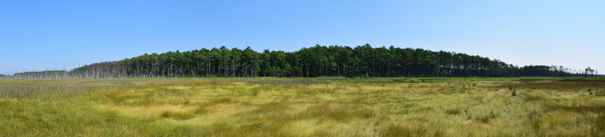

```{r setup, include=FALSE}
knitr::opts_chunk$set(echo = TRUE)
```



# Plant competition dominates grass species interactions in a migrating marsh-forest ecotone

This repository stores all the information related to the manuscript *Plant competition dominates at the leading edge of a migrating marsh-forest ecotone*, including the raw datasets and the scripts to perform data analysis.

## Contents

This repository is organised following the advice of [Wilson et al. 2017](https://doi.org/10.1371/journal.pcbi.1005510) for recording and storing research projects.


The following materials are available in the folders of this repository:

* `data` Original data files, including the results of the [greenhouse experiments](https://github.com/efernandezpascual/ecotone/blob/master/data/greenhouse.csv) and the [field measurements](https://github.com/efernandezpascual/ecotone/blob/master/data/field.csv).
* `src` Scripts in `R` language used to perform the analyses of the manuscript, including [the effect of stress and competition on biomass (hypothesis 1)](https://github.com/efernandezpascual/ecotone/blob/master/src/biomass.R), [effect of stress and competition on species interactions (hypothesis 2)](https://github.com/efernandezpascual/ecotone/blob/master/src/rii.R) and [effect of forest cut on marsh species growth (hypothesis 3)](https://github.com/efernandezpascual/ecotone/blob/master/src/field.R).
* `results` Output of the `R` scripts, including figures and model tables.

## Abstract

Ecotone communities are areas of high species turnover and steep environmental gradients. We investigated how environmental gradients shape species interactions between upland and tidal wetland grass species to shed light on zonation in these species’ distribution patterns, in the context of understanding how their distributions may change with sea level rise and forest dieback. Across the coastal marsh-forest ecotone, there are stark shifts in two fundamental conditions for plants: salinity and light availability. We measured these abiotic conditions and plant productivity at sites spanning the ecotone and within a forest clear-cut, where canopy shading had been experimentally removed. In a greenhouse manipulation of plant species neighbor, salinity, and light availability, we hypothesized that plant interactions would become more facilitative in stressful conditions and that more salt tolerant species would also be more light-demanding. Species salt tolerance followed an expected ranking based on species zonation in the field, but all species responded similarly to reductions in light. Plant interactions in all treatments were negative or neutral, never facilitative. Despite low resource availability of light and elevated levels of salinity within the marsh-forest ecotone, plant interactions there reflect a benign stress environment, with competition predominant and with resource limitation, stress, and competition having additive, negative effects on plant performance.

## Citation

Please cite the repository, datasets and manuscript as: 

> Gedan KB, Hoot WC, Fernández-Pascual E. *Plant competition dominates grass species interactions in a migrating marsh-forest ecotone*