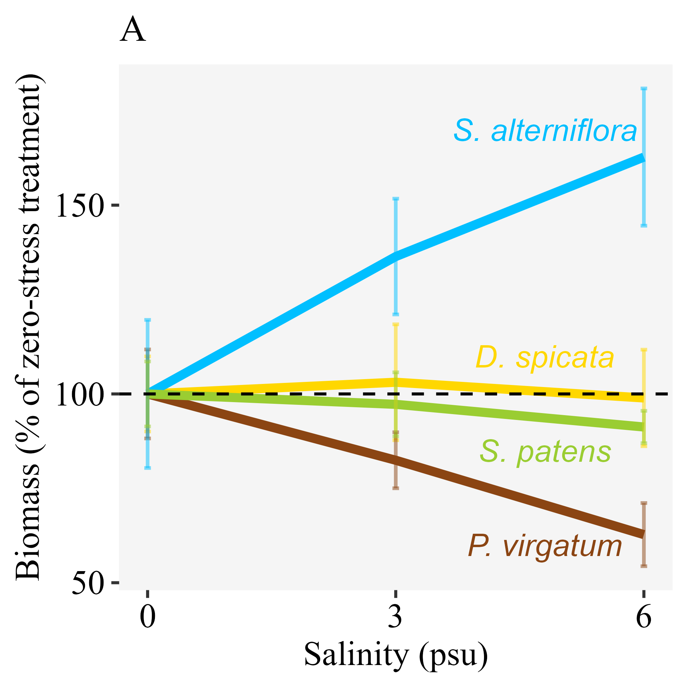

```{r setup, include=FALSE}
knitr::opts_chunk$set(echo = TRUE)
```

```{r message = FALSE, echo = FALSE, warning = FALSE}
knitr::knit_hooks$set(inline = function(x) {
  prettyNum(x, big.mark = ",")
})
```

```{r message = FALSE, echo = FALSE, warning = FALSE}
library(tidyverse); library(flextable)
```

Keryn B. Gedan^1^ ^+^, Whitney Hoot^2^, Eduardo Fernández-Pascual^1,3^

^1^ Biological Sciences, George Washington University, Washington, District of Columbia, USA; ^3^ IMIB – Biodiversity Research Institute, University of Oviedo, Mieres, Spain

^+^ Correspondence: Biological Sciences, George Washington University, 800 22nd St. NW, Suite 6000, Washington, DC 20052. Email: kgedan@gwu.edu

# Abstract

# Keywords

# Introduction

Global change is producing rapid shifts in species distributions [@RN3389]. These shifts are being detected in the form of migrating ecosystems, such as alpine plant communities and treelines moving upwards as a consequence of warming [@RN4987], or coastal marshes being pushed landwards by sea level rise [@RN4972; @RN5053]. At the leading edge of these migrating ecosystems, conditions are those of an ecotone, and thus species distributions and abundances are affected by edge effects [@RN4986]. Of the mechanisms explaining edge effects, species interactions have received relatively little attention [@RN4986]; and among species interactions even less attention has been paid to interactions between species within the same trophic level [@RN4984]. Therefore, there are few generalizable rules about what type of ecological interactions to expect at a migrating ecotone. Nevertheless, a sound theoretical framework could be provided by the environmental stress gradient hypothesis, which suggests more intense competition where stress is low and more facilitative interactions where stress is high [@RN4989; @RN4994].

The environmental stress gradient hypothesis is especially relevant for the migrating ecotone between tidal marshes and coastal forests, a system that is structured along strong and universal stress gradients, forming a stark zonation of plant communities [@RN4990]. At the marsh-forest ecotone, there are two abiotic gradients relevant to plants that exhibit major shifts: (1) salinity, which declines from the saline tidal marsh to the nonsaline upland forest, and (2) light availability, which declines from the low stature, graminoid community of the tidal marsh to the sub-canopy shrub-herbaceous community and the tree canopy of the upland forest [@RN4995]. Although salinity is a universal stress for terrestrial plant species, salinity stress will have a more negative effect on glycophytic upland plants relative to halophytic marsh plants. On the other hand, low light availability, also a universal challenge for photosynthetic plants, is likely to have a more negative effect on marsh plants, which generally reside in open sun environments and have high light demand. 

A more refined interpretation of the environmental stress gradient hypothesis takes into account specific features of both the stress factors and the interacting species [@RN4985]. Regarding stress features, it is necessary to differentiate between stress that is resource-related (such as light availability) and non-resource-related (such as salinity). When stress is induced by a resource that is needed by both species, as is the case of light availability for co-occurring plants, the conceptual paradigm of the environmental stress gradient hypothesis may not hold [@RN4985]. If limited light availability is the main limiting stress factor, competition can only shift to facilitation when neighbors can increase the availability of the resource for the other species [@RN4991], which is unlikely to happen in an herbaceous understory assemblage. Salinity stress, on the other hand, is not resource-related, and plant interactions can switch from competitive to facilitative when neighbors ameliorate soil salinity [@RN4994]. In relation to the features of the interacting species, the response of their relationship to environmental stress is expected to depend on each species' ability to compete and to tolerate stress [@RN2279]. 

In this study, we sought to characterize plant interactions across the ecotone between tidal marsh and upland forest. In our study region of the Chesapeake Bay (USA), this ecotone is rapidly shifting due to sea level rise, as tidal marsh migrates inland [@RN4992; @RN5054]. Therefore, understanding species interactions across this ecotone may help us to understand the biotic and abiotic controls on species distributions within these dynamic ecosystems, and could also elucidate management options with the goal of conserving tidal marsh ecosystems in the face of accelerated sea level rise [@RN4993]. For example, if species interactions on the upland edge of the ecotone are largely competitive for marsh plants, then clearing upland plants may reduce competition for migrating individuals and increase the rate or success of migration. Similarly, if interactions are largely facilitative along this boundary, then we would expect that clearing upland plants in the way of migrating marsh plants would negatively affect migration outcomes. This is particularly relevant as forest clearing is being considered as a management alternative to increase marsh migration. The rationale for this management tactic is altering the light environment at ground level, which is thought to favor marsh plant success.

We asked the question of whether the environmental stress gradient hypothesis can be applied across an ecotone where strong and universal stress gradients exist. We examined the interactions of three marsh grasses (*Spartina alterniflora* Loisel., *Spartina patens* (Aiton.), *Distichlis spicata* (L.) Greene) with one upland grass (*Panicum virgatum* L.) in a controlled greenhouse environment where we could manipulate abiotic factors to mimic opposing sides of the edge, and tease apart the effects of light availability and salinity stress, while controlling for other factors. We also surveyed field conditions where forest canopy cover had been experimentally disturbed to test the capacity of high marsh species to colonize the ecotone of intact and disturbed sites. With this experimental set up, we attempted to test the following predictions: (1) marsh species would be more salinity-tolerant, and the upland species would be more shade-tolerant and a better competitor for light, (2) the interactions between marsh species and the upland species would shift from negative to positive with increasing values of salinity, but not of shade, and (3) marsh grasses would have a greater capacity to grow landwards when the forest canopy is removed.

# Materials and methods

## Field work

In June and July 2015, field work was conducted at a representative marsh-forest ecotone at Moneystump Marsh (Blackwater National Wildlife Refuge, Dorchester County, Maryland, USA). The area encompasses a brackish marsh and a neighboring forest of loblolly pine (*Pinus taeda* L.). Local land cover has experienced large changes in the last century that include a high degree of marsh loss [@RN4980; @RN5055] and marsh migration [@RN4981]. Changes have been attributed to high rates of relative sea level rise, which are 4 to 10 mm/yr [@RN4982], well above the global average [@RN4983], as well as shallow upland slopes [@RN5056].

Within the Moneystump Marsh, three field sites were selected within 1 km of one another. Two sites (“Control East” and “Control West”) had intact marsh-upland ecotones. At the third site (“Forest Cut”), 3 ha of forest had been experimentally clearcut in August 2014, as part of a forest disturbance and marsh migration experiment. Site conditions at Forest Cut were similar to Control East and Control West in all regards, except light availability in the cleared forest, and other conditions indirectly affected by light availability, such as soil temperature and humidity. In each of the three sites, three locations were identified along the marsh-forest gradient: (1) high marsh edge, (2) mid-ecotone, and (3) forest edge. High marsh edge, mid-ecotone, and forest edge locations were determined based on the plant communities, with the high marsh edge characterized by the indicator species salt marsh hay *Spartina patens* (Aiton.) Muhl. and marsh elder *Iva frutescens* L., the mid-ecotone characterized by switchgrass *Panicum virgatum* L. and eastern baccharis *Baccharis halimifolia* L., and the forest edge characterized by loblolly pine *Pinus taeda*. 

To characterize the light gradient across the ecotone, photosynthetically active radiation (PAR) measurements were made at all locations at the Control East site at 1 m height using an Apogee light meter with a 3-sensor wand. As expected, light availability decreased from the high marsh (1,693 μmol m^-2^ s^-1^) to the mid-ecotone (1,492 μmol m^-2^ s^-1^) and forest edge (1,138 μmol m^-2^ s^-1^). To characterize variation in salinity across the ecotone, soil porewater (n = 6) was collected from the top 5 cm of the soil at six points within each location (high marsh, mid-ecotone, and forest edge) at each site (Control East, Control West, and Forest Cut) during a neap tide in July using a syringe, and porewater salinity was measured on a handheld refractometer. As expected, average salinity decreased from the high marsh (4.6 psu) to the mid-ecotone (3.5 psu) and forest edge (2.7 psu). Field conditions of light and salinity were used to inform experimental treatment levels in the greenhouse experiment.
 
Finally, aboveground biomass of naturally occurring high-marsh grasses (*S. patens* and *Distichlis spicata* (L.) Greene) was collected at five haphazardly selected 10 x 10 cm quadrats at each location within each site to investigate the field effects of salinity and light availability on natural biomass production. Aboveground biomass of the two grass species was dried in a drying oven at 60 ºC until constant mass and weighed. The resulting field biomass dataset is available in the data folder of the GitHub repository (see Data Availability Statement).

## Greenhouse experiment

A greenhouse experiment was set up to investigate plant responses to stress and competition. Based on their common occurrence at the field sites, we selected four grass species (Poaceae) that were common along the ecotone: (1) the upland plant *P. virgatum* was chosen as a focal competitor for the analysis, as indicator species of the marsh-forest ecotone: in the field, this species grows best in the low light and low salinity conditions of the leading edge of the ecotone [@RN4995]; (2) *S. patens* and (3) *D. spicata* were chosen as indicator species of the high-marsh; and (4) *Spartina alterniflora* Loisel. was chosen as an indicator species of the low marsh. This last species was included because, at some of the marshes of the US East Coast, the high marsh zone is missing and the marsh grades directly from *S. alterniflora* low marsh to the ecotone. 

Plants of the four species were purchased as 5 cm x 5 cm plugs from a commercial plant nursery (Environmental Concern, St. Michaels, MD). Roots of plugs were gently separated before being planted alone (i.e. no competition) or with a neighbor (i.e. competition). To focus on ecotone interactions between upland and tidal marsh species, the neighbor crosses consisted of *P. virgatum* and one of the three marsh species. Plants were planted within one week of purchase, in experimental pots (11.4 x 11.4 x 15.2 cm) filled with Px-1 Metro Mix Soil. Thus, each pot contained either one (no competition pots) or two (competition pots) individual plants. Pots were transferred to a greenhouse bay where they were watered with fresh water to recover from transplant stress for a period of 10 days. After the recovery period, plants were transferred to trays without drainage holes to mimic flooded conditions. Each tray contained all neighbor combinations. One week later, shade and salinity treatments were started. 

To mimic the soil salinity of deep forest, forest edge, and tidal marsh, individual trays were watered with 0, 3, and 6 psu water. Salinities were achieved by adding Instant Ocean salt to tap water. To gently acclimate plants to salinity treatments, the salinity of the 3 and 6 psu treatments was raised gradually, from 0 to 1 to 3 to 6 psu over eight days. Trays were drained and re-watered with the assigned salinity every 3 days to maintain treatment levels and prevent the build-up of excessive porewater salinity through evapotranspiration.    

To mimic the shade of deep forest, forest edge, and tidal marsh, shade tents were placed above the trays. Shade tents were 1.6 x 1.0 x 1.3 m (w x l x h), and were built from a PVC pole frame with a roof of 75% shade cloth (Heavy Green Sun Fabric, Easy Gardener) that overhung the sides of the frame by 0.5 m on all sides. Shade treatments had three levels: ambient light (tent frame without a shade), 75% reduction in ambient light (single layer of shade cloth), and 90% reduction in ambient light (double layer of shade cloth). There were four replicates of each level of shade. Each shade tent housed six trays, two of each salinity level. To confirm that the expected abiotic conditions were met, regular measurements were made of light in all shade treatments with a handheld light meter (Apogee Instruments) and of salinity in all water reservoirs using a refractometer. 

The experimental treatments were continued for 16 weeks, during which treatments were regularly rotated around the room to avoid orientation or room biases, before plants were harvested. To separate roots and disentangle roots of neighboring plants for biomass measurements, plant roots were power washed to remove soil. Above and belowground biomass of individual plants was dried in a drying oven at 60 ºC until constant mass, and then weighed. The resulting greenhouse biomass dataset is available in the data folder of the GitHub repository (see Data Availability Statement).

## Statistical analysis

### Goal 1 - Species responses to salinity, shade, and competition

To test the stress-tolerant or competitive character of the study species, the greenhouse biomass dataset was analyzed using linear mixed models as implemented in the 'nlme' package [@RN2333] of R [@RN2315]. First, fully factorial models were fitted, including the main effects of species identity, competition (i.e. whether the species was planted alone or with a neighbor), salinity,and shade; plus all possible interactions; plus shade tent and tray as random factors. Then a model selection was applied, sequentially removing non-significant interactions, until the minimal adequate model that best explained the data was found [@RN3202]. The R script for this and subsequent analyses are available in the src folder of the GitHub repository (see Data Availability Statement).

### Goal 2 - Effect of salinity and shade on interactions with *P. virgatum*

To measure the interactions of the migrating marsh species with the upland grass *P. virgatum*, relative interaction indices (RIIs) [@RN4979] were calculated using the greenhouse biomass dataset. RIIs were calculated at the tray level for each marsh species, following 

RII = (B~a~ - B~n~) / (B~a~ + B~n~)

where B~a~ is the biomass of the species when grown alone and B~n~ is the biomass of the species when grown with *P. virgatum* as a neighbor. RIIs take values from -1 (maximum competition) to +1 (maximum facilitation), with zero indicating no effect.

The interactive effects of salinity, shade, and species identity on the RIIs of their interaction with *P. virgatum* were modeled using linear mixed models as implemented in the 'nlme' package [@RN2333] of R [@RN2315]. Models were fitted and reduced with the same model selection procedure as described above.

### Goal 3 - Effect of canopy cut on field growth of high marsh grasses

To test the effect of forest clearings in the ability of high marsh grasses to colonize landwards, the field biomass dataset was analyzed by fitting a linear model in R [@RN2315]. The linear model included field site, marsh-forest gradient location, and their interaction.

# Results

## Goal 1 - Effect of salinity, shade and competition on biomass growth

Results of the greenhouse experiment indicated that biomass growth was driven by two significant (p < 0.05) interactions, one between species identity and responses to salinity, and another between competition and responses to shade (**Table 1**). 

Thus, the response to salinity was species-dependent and was unaffected by shade or competition: the low marsh grass *S. alterniflora* produced higher biomass with increasing salinity; the high marsh indicators *S. patens* and *D. spicata* were indifferent to salinity; and the marsh-forest ecotone species *P. virgatum* had a negative response to increasing salinity (**Fig. 1**).

At the same time, the growth response to shade was not significantly different between the four species (p > 0.05): all species responded negatively to increasing levels of shade (**Fig. 2**). Response to shade did not interact with salinity, but was affected by whether the plants were grown alone or in competition: plants in competition produced less biomass than plants grown alone in all levels of shade (**Fig. 2**). At the highest level of shade, the reduction in biomass was less pronounced in plants grown in competition, which were already biomass-limited by the competitor.

## Goal 2 - Effect of salinity and shade on the competitive interactions with *P. virgatum*

The analysis of the net RIIs showed that the strength of competition was not affected by salinity or species identity; only shade had a significant effect (**Table 2**). The interaction of the marsh species with *P. virgatum* was most negative at the middle shade treatment, and become the least negative in the full shade treatment, without ever becoming positive, i.e. facilitative (**Fig. 3**). 

## Goal 3 - Effect of canopy cut on field growth of high marsh grasses

The field biomass measurements showed a higher capacity of high marsh grasses (*S. patens* and *D. spicata*) to colonize landwards (i.e. forest locations) at the forest cut site (**Fig. 4**). There were significant differences in biomass along the marsh-forest gradient, but these were affected by the site where the measurements were made (**Table 3**): at the two intact forest control sites, biomass sharply declined at the forest locations; while at the forest cut site the biomass of the marsh grasses was still high in forest locations (**Fig. 4**). 

# Discussion

Our field investigation supported categorization of the marsh-forest transition as co-occuring and countervailing stress gradients of salinity and shade. In the greenhouse experiment, species varied in their tolerance of salinity stress following the zonation of the system, with the upland species *Panicum virgatum* exhibiting the most severe reduction in biomass, followed by high marsh species *Spartina patens* and *Distichlis spicata*. The low marsh species *Spartina alterniflora* exhibited a true halophytic response with elevated biomass at moderate levels of salinity relative to a salinity-free control. In contrast, species did not vary in their tolerance of shade. All species exhibited reduced biomass in response to experimental shading and even greater reduction in response to shade when in competition. Although often characterized as species with high light demand [@RN5059], the marsh species were no more susceptible to shade stress than the upland species. Competition reduced biomass production for all species; contrary to our hypothesis that the upland species would be a superior competitor, there were no observed differences in the tolerance of species to competition. 

A key feature of tests of the environmental stress gradient hypothesis is that they include levels of stress that are limiting to the species in the community of interest. Our greenhouse experimental treatments realistically re-created the stress gradients observed in the field. The salinity treatments, from 0 to 6 psu, encompassed all levels observed in the field study. Low salinity (<2 psu) and low light availability (<50%) were not observed in the field survey, but were included in the greenhouse treatments, as they have been observed in other studies of this system [@RN4995] **(Shaw et al. in press)**. These levels represent physical extremes important to include in experimental tests of the environmental stress gradient hypothesis [@RN5057].

Interactions among our species were competitive regardless of stress level or stress type (i.e. resource or non-resource). As there were no shifts from negative to positive interactions with increasing stress, the environmental stress gradient hypothesis does not provide an appropriate framework for the marsh-forest transition. This framework, which works so well to describe interactions across tidal marsh plant communities [@RN4994], breaks down at the terrestrial border. In this ecotone, facilitation in the form of salinity amelioration was unlikely to benefit salt-tolerant marsh species, and there is no mechanism to increase light availability by facilitative interactions between herbaceous species. This finding does not discount the environmental stress gradient hypothesis, but rather reveals a more complex situation in this ecotone plant community, with its countervailing stress gradients, which is more akin to the exception described by He and Bertness [-@RN5057] in which "multiple potentially lethal stress gradients are not spatially correlated, so cancel out effects".

Despite a clear hierarchy in salinity stress tolerance, a simple model of plant-plant competition for scarce light resources is a better fit for the marsh-forest ecotone plant assemblage. Competition between marsh and upland species was most intense in full sun or moderate shade. In the deepest shade treatment, or 90% shade, inter-specific interactions became more neutral. Severe resource limitation dulls the knife of competition; instead, at very low levels of resource availability, plants struggle to maintain positive metabolic balance. 

Except in deep shade, the negative effects of shade and competition on marsh grass productivity were additive. This finding suggests that increasing light availability, by canopy thinning, tree removal, or perhaps removal of understory competitor species following canopy opening, would favor increased productivity and dominance by marsh graminoids. This result is further supported by field data, which showed that marsh species reached greater biomass in the forest after cutting. 

Observational evidence suggests that the marsh-forest ecotone may provide an opportunity for establishment and spread of invasive species [@RN5054]. A common invasive species in tidal wetlands around the world, including our study region, *Phragmites australis*, can establish in shade and grow quickly when light is available [@RN4995] **(Shaw et al. in press)**. The effectiveness of forest cutting in promoting native marsh grasses would be dependent on active management to prevent dominance by *P. australis*. This management recommendation may also apply to other invasive species in other regions of the world.  

Successful migration of tidal marshes during the next century will be critical to retain habitat area of this highly valuable ecosystem. Marsh migration is dependent upon the availability and suitability of upland accomodation space [@RN5058]. This investigation of interspecific interactions among plant species at the marsh-forest ecotone provides an ecological perspective on marsh migration and a foundation for future work. This study highlights the important role of light availability and plant-plant competition in the marsh-forest ecotone community and provides support for testing the management activity of forest cutting as a means to promoting marsh migration.

# Funding

E.F.P. was supported by the Jardín Botánico Atlántico [SV-20-GIJON-JBA]. 

# Data availability

The original datasets, R code for the analysis and creation of the manuscript can be accessed at the GitHub repository https://github.com/efernandezpascual/ecotone. Upon publication, a version of record of the repository will be deposited in Zenodo.

# References

::: {#refs}
:::

# Figures

```{r fig1, echo = FALSE, fig.pos = "H", fig.cap = "Species responses to salinity. Final biomass produced in the greenhouse for each of the four study species, in each of the salinity treatments. Results shown are for the no shade, no competition treatment. Lines indicate the average biomass at each level of salinity, and whiskers the standard error. For ease of comparison, all values were standardized by dividing them by the species mean biomass at the 0 salinity treatment."}

```

```{r fig2, echo = FALSE, fig.pos = "H", fig.cap = "Responses to shade and competition. Final biomass produced in the greenhouse for plants grown alone and in competition, in each of the shade treatments. Results shown are for the no salinity treatment, and averaging across the four study species. Lines indicate the average biomass at each level of shade, and error bars the standard error. For ease of comparison, all values were standardized by dividing them by the mean biomass of the no shade, no competition treatment."}
knitr::include_graphics("../results/f2.png")
```

```{r fig3, echo = FALSE, fig.pos = "H", fig.cap = "Competition between three marsh grasses and the upland forest grass *Panicum virgatum* grown in the greenhouse. The Relative Interaction Index (RII) was calculated for each marsh species by comparing its growth alone to its growth when grown with *P. virgatum*. The RIIs were calculated by averaging all treatments of salinity for all species. Bars indicate the average RII, and error bars the standard error. Positive values of the RII would indicate a facilitative interaction, while negative values indicate a competitive interaction, and zero a neutral interaction."}
knitr::include_graphics("../results/f3.png")
```

```{r fig4, echo = FALSE, fig.pos = "H", fig.cap = "Field production of high marsh grasses (*Spartina patens* and *Distichlis spicata*). Lines indicate the average aggregated biomass of the two species at three locations in the marsh-forest gradient, and error bars the standard error. Biomass was collected from three sites: two control intact forest sites and a forest cut site where the canopy had been removed."}
knitr::include_graphics("../results/f4.png")
```

# Tables

```{r table1, echo = FALSE}
read.csv("../results/Table1.csv") %>% rename(`Chi-squared` = Chi.squared) %>% flextable() %>% autofit() %>% align(j = 4, align = "right", part = "all") %>% fontsize(size = 12) %>% set_caption("Table 1 Anova table for the effect of species identity, salinity, shade and competition on final biomass in the greenhouse. The output shown is for a minimal adequate model selected by sequential removal of non-significant interactions. The model is a linear mixed model with shade tent and tray as random factors.")
```

```{r table2, echo = FALSE}
read.csv("../results/Table2.csv") %>% rename(`Chi-squared` = Chi.squared) %>% flextable() %>% autofit() %>% align(j = 4, align = "right", part = "all") %>% fontsize(size = 12) %>% set_caption("Table 2 Anova table for the effect of shade on the net Relative Interaction Index (RII) of three marsh species competing with *Panicum virgatum* in the greenhouse. The output shown is for a minimal adequate model selected by sequential removal of non-significant interactions and main effects from a starting model that included species identity, salinity and shade. The model selection procedure retained only the main effect of shade. The model is a linear mixed model with shade tent and tray as random factors.")
```

```{r table3, echo = FALSE}
read.csv("../results/Table3.csv") %>% flextable() %>% autofit() %>% align(j = 4, align = "right", part = "all") %>% fontsize(size = 12) %>% set_caption("Table 3 Anova table for the effect of site and location along the marsh-forest gradient on the aggregate biomass of high marsh grasses (*Spartina patens* and *Distichlis spicata*) collected in the field. The model is a linear model.")
```
