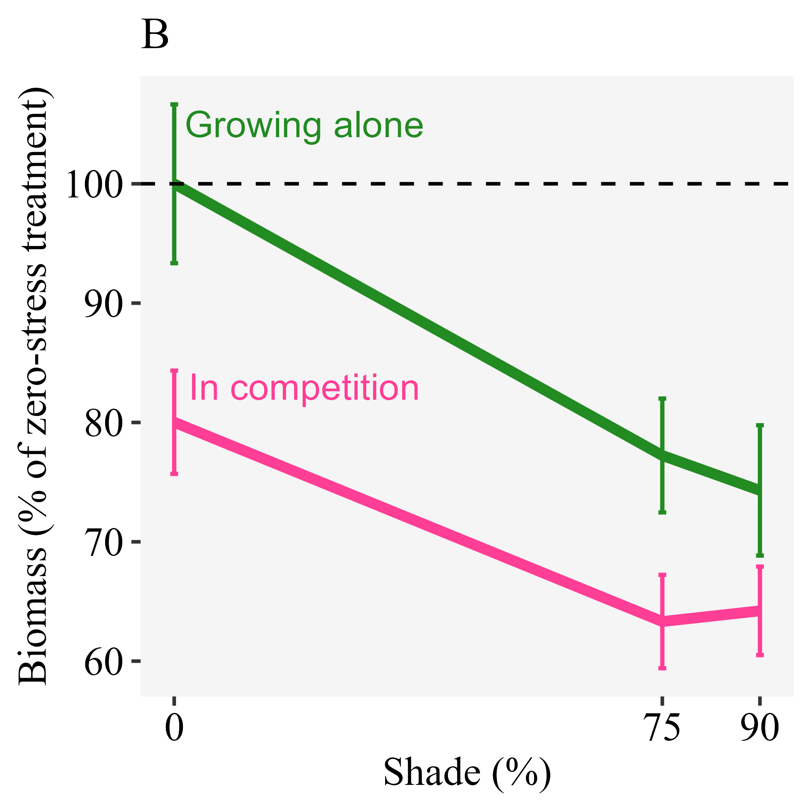
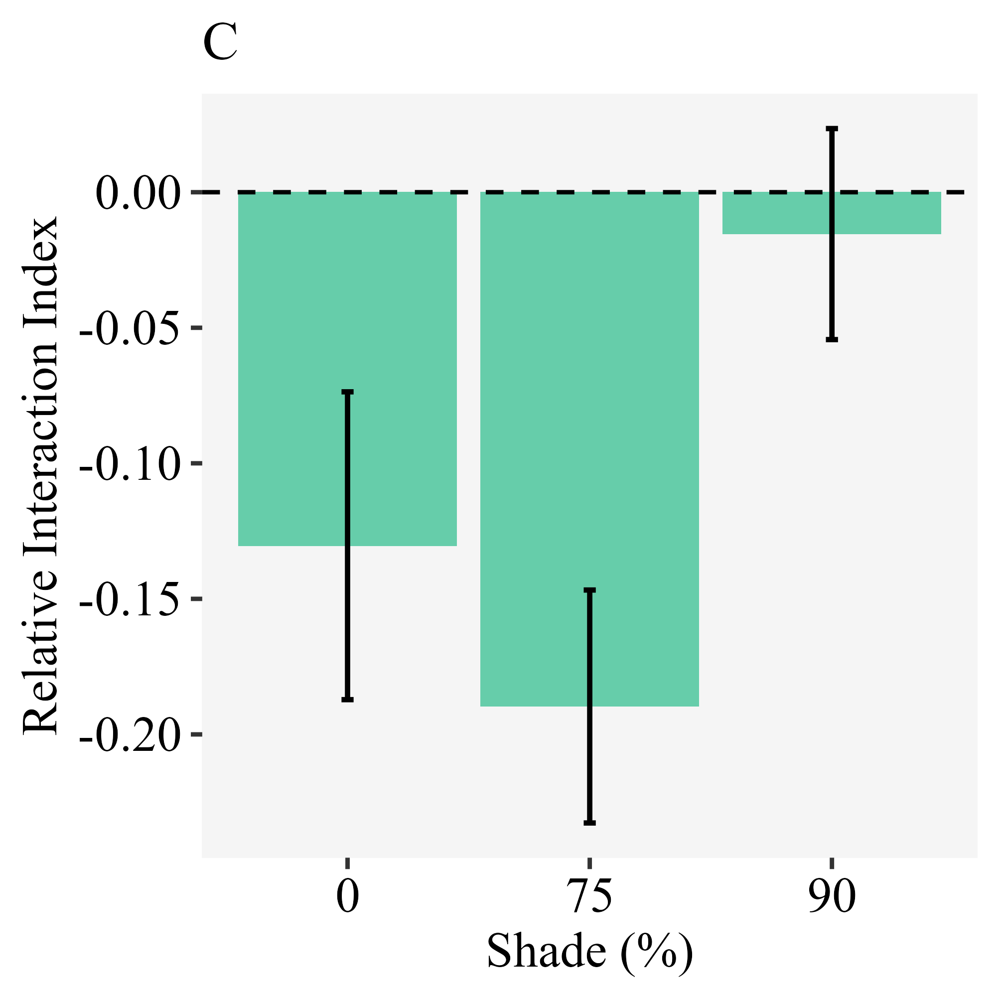

```{r setup, include=FALSE}
knitr::opts_chunk$set(echo = TRUE)
```

```{r message = FALSE, echo = FALSE, warning = FALSE}
knitr::knit_hooks$set(inline = function(x) {
  prettyNum(x, big.mark = ",")
})
```

```{r message = FALSE, echo = FALSE, warning = FALSE}
library(tidyverse); library(flextable)
```

Keryn B. Gedan, Whitney Hoot, Eduardo Fernández-Pascual

# Abstract

# Keywords

# Introduction

# Materials and methods

## Field work

In 2 June 2015, a visit was made to a representative marsh-forest ecotone at Moneystump Marsh (Blackwater National Wildlife Refuge, Dorchester County, Maryland, USA). The area encompasses a brackish marsh and a neighboring forest of loblolly pine (*Pinus taeda* L.). Local land cover has experienced large changes in the last century that include a high degree of marsh loss [@RN4980] and marsh migration [@RN4981]. Changes have been attributed to high rates of relative sea level rise, which are 4 to 10 mm/yr [@RN4982], well above the global average [@RN4983].

Within the Moneystump Marsh, three field sites were selected within 1 km of one another. Two sites (“Control East” and “Control West”) had intact marsh-upland ecotones. At the third site (“Forest Cut”), 3 ha of forest had been experimentally cut in August 2014, as part of a forest disturbance and marsh migration experiment. Site conditions at Forest Cut were similar to Control East and Control West in all regards, except light availability in the cleared forest, and other conditions indirectly affected by light availability, such as soil temperature and humidity. In each of the three sites, three points were chosen along the marsh-forest gradient: (1) high marsh edge, (2) mid-ecotone, and (3) forest edge. High marsh edge, mid-ecotone, and forest edge points were determined based on the plant communities, with the high marsh edge characterized by the indicator species *Spartina patens* (Aiton.) Muhl. and *Iva frutescens* L., the mid-ecotone characterized by *Panicum virgatum* L. and *Baccharis halimifolia* L., and the forest edge characterized by *Pinus taeda*. 

To characterize the light gradient across the ecotone, light measurements were collected at all points at the Control East site at 100 cm height using an Apogee light meter. Light availability decreased from the high marsh (1,693 μmol m^-2^ s^-1^) to the mid-ecotone (1,492 μmol m^-2^ s^-1^) and forest edge (1,138 μmol m^-2^ s^-1^). To characterize variation in salinity across the ecotone, soil porewater (n = 6 ) was collected from the top 5 cm of the soil at six points within each location (high marsh, mid-ecotone, and forest edge) at each site (Control East, Control West, and Forest Cut) during a neap tide in July using a syringe, and porewater salinity was measured on a handheld refractometer. Average salinity decreased from the high marsh (4.6 psu) to the mid-ecotone (3.5 psu) and forest edge (2.7 psu).
 
Finally, aboveground biomass of naturally occurring high-marsh grasses (*S. patens* and *Distichlis spicata* (L.) Greene) was collected at five haphazardly selected 10 x 10 cm quadrats at each point within each site to investigate the field effects of salinity and light availability on natural biomass production. Aboveground biomass of the two grass species was mixed, dried in a drying oven at 60 ºC until constant mass, and weighed. The resulting field biomass dataset is available in the data folder of the GitHub repository (see Data Availability Statement).

## Greenhouse experiment

A greenhouse experiment was set up to investigate plant responses to stress and competition. Based on their occurrence at the field sites, we selected four grass species (Poaceae) that were common along the ecotone: (1) the upland plant *P. virgatum* was chosen as a focal point for the analysis, as indicator species of the marsh-forest ecotone; (2) *S. patens* and (3) *D. spicata* were chosen as indicator species of the high-marsh; and (4) *Spartina alterniflora* Loisel. was chosen as indicator species of the low marsh. This last species was included because, at some of the marshes of the US East Coast, the high marsh zone is missing and the marsh grades directly from the *S. alterniflora* low marsh to the ecotone. 

Plants of the four species were purchased as 5 cm x 5 cm plugs from a plant nursery (Environmental Concern, St. Michaels, MD). Roots of plugs were gently separated before being planted alone (i.e. no competition) or with a neighbor (i.e. competition). To focus on ecotone interactions between upland and tidal marsh species, the neighbor crosses consisted of *P. virgatum* and one of the three marsh species. Plants were planted within one week of purchase, in experimental pots (11.4 x 11.4 x 15.2 cm) filled with Px-1 Metro Mix Soil. Thus, each pot contained either one (no competition pots) or two (competition pots) individual plants. Pots were transferred to a greenhouse bay where they were watered with fresh water to recover from transplant stress for a period of 10 days. After the recovery period, plants were transferred to trays without drainage holes to mimic flooded conditions. Each tray contained all neighbor combinations. One week later, shade and salinity treatments were started. 

To mimic the soil salinity of deep forest, forest edge, and tidal marsh, individual trays were watered with 0, 3, and 6 psu water. Salinities were achieved by adding Instant Ocean salt to tap water. To gently acclimate plants to salinity treatments, the salinity of the 3 and 6 psu treatments was raised gradually, from 0 to 1 to 3 to 6 psu over eight days. Trays were drained and re-watered with the assigned salinity every 3 days to maintain treatment levels and prevent the build-up of excessive porewater salinity through evapotranspiration.    

To mimic the shade of deep forest, forest edge, and tidal marsh, shade tents were placed above the trays. Shade tents were 1.6 x 1.0 x 1.3 m (w x l x h), and were built from a PVC pole frame with a roof of 75% shade cloth (Heavy Green Sun Fabric, Easy Gardener) that overhung the sides of the frame by 0.5 m on all sides. Shade treatments had three levels: ambient light (tent frame without a shade), 75% reduction in ambient light (single layer of shade cloth), and 90% reduction in ambient light (double layer of shade cloth). There were four replicates of each level of shade. Each shade tent housed six trays, two of each salinity level. To confirm that the expected abiotic conditions were met, regular measurements were made of light in all shade treatments with a handheld light meter (Apogee Instruments) and of salinity in all water reservoirs using a refractometer. 

The experimental treatments were continued for 16 weeks, during which treatments were regularly rotated around the room to avoid orientation or room biases, before plants were harvested. To separate roots and disentangle roots of neighboring plants for biomass measurements, plant roots were power washed to remove soil. Individual plants (including above and belowground biomass) were dried in a drying oven at 60 ºC until constant mass, and then weighed. The resulting greenhouse biomass dataset is available in the data folder of the GitHub repository (see Data Availability Statement).

## Statistical analysis

### Goal 1 - Effect of salinity, shade and competition on biomass growth

To test the interactive effects of salinity, shade and competition on plant growth, the greenhouse biomass dataset was analyzed using linear mixed models as implemented in the 'nlme' package [@RN2333] of R [@RN2315]. First, fully factorial models were fitted, including the main effects of species identity, competition (i.e. whether the species was planted alone or with a neighbor), salinity and shade; plus all possible interactions; plus shade tent and tray as random factors. Then a model selection was applied, sequentially removing non-significant interaction, until the minimal adequate model that best explained the data was found [@RN3202]. The R script for this and subsequent analyses are available in the src folder of the GitHub repository (see Data Availability Statement).

### Goal 2 - Effect of salinity and shade on the competitive interactions of *P. virgatum*

To measure the competitive interactions of *P. virgatum* with the migrating marsh species, relative interaction indices (RIIs) [@RN4979] were calculated using the greenhouse biomass dataset. RIIs were calculated at the tray level for each species and neighbor, following 

RII = (B~a~ - B~n~) / (B~a~ + B~n~)

where B~a~ is the biomass of the species when grown alone and B~n~ is the biomass of the species when grown with a neighbor. RIIs take values from -1 (maximum competition) to +1 (maximum facilitation), with zero indicating no effect.

To focus on *P. virgatum*, a net RII was calculated for each pairwise interaction of *P. virgatum* with a marsh species, by subtracting the RII calculated for the marsh species from the RII calculated for *P. virgatum*. Positive values of the net RII would indicate a competitive dominance of *P. virgatum*, while negative values would indicate a dominance of the marsh species, and zero would indicate equality.

The interactive effects of salinity, shade and competitor species on the net RIIs of *P. virgatum* were modeled using linear mixed models as implemented in the 'nlme' package [@RN2333] of R [@RN2315]. First, fully factorial models were fitted, including the main effects of competitor identity, salinity and shade; plus all possible interactions; plus shade tent and tray as random factors. Then a model selection was applied, sequentially removing non-significant interaction, until the minimal adequate model that best explained the data was found [@RN3202]. 

### Goal 3 - Effect of canopy cut on field growth of high marsh grasses

To test the effect of forest clearings in the ability of high marsh grasses to colonize landwards, the field biomass dataset was analyzed by fitting a linear model in R [@RN2315]. The linear model included field site, marsh-forest gradient position, and their interaction.

# Results

## Goal 1 - Effect of salinity, shade and competition on biomass growth

Results of the greenhouse experiment indicated that biomass growth was driven by two significant (p < 0.05) interactions, one between species identity and responses to salinity, and another between competition and responses to shade (**Table 1**). 

Thus, the response to salinity was species-dependent and did not interact with shade or competition: the low marsh grass *S. alterniflora* produced higher biomass with increasing salinity; the high marsh indicators *S. patens* and *D. spicata* were largely indifferent to salinity; and the marsh-forest ecotone species *P. virgatum* had a negative response to increasing salinity (**Fig. 1**).

At the same time, the growth response to shade was not significantly different between the four species (p > 0.05): all species responded negatively to increasing levels of shade (**Fig. 2**). Response to shade did not interact with salinity, but was affected by whether the plants were grown alone or in competition: plants in competition produced less biomass than plants grown alone in all levels of shade (**Fig. 2**), but at the highest level the decrease was less pronounced in plants grown in competition, since they were already limited by the competitor. 

## Goal 2 - Effect of salinity and shade on the competitive interactions of *P. virgatum*

The analysis of the net RIIs showed that the strength of competition was not affected by the levels of salinity or shade; and only the competitor identity had a significant effect (**Table 2**). *P. virgatum* had competitive domination over the low marsh plant *S. alterniflora* as indicated by a positive net RII; while its net RIIs with the high marsh species *S. patens* and *D. spicata* were close to zero, indicating a balanced competition (**Fig. 3**). 

## Goal 3 - Effect of canopy cut on field growth of high marsh grasses

The field biomass measurements supported a higher capacity of high marsh grasses (*S. patens* and *D. spicata*) to colonize landwards at the forest cut site (**Fig. 4**). There were significant differences in biomass along the marsh-forest gradient, but these were affected by the site where the measurements were made (**Table 3**): at the two intact forest control sites, biomass sharply declined at the deep forest points; while at the forest cut site the biomass of the marsh grasses was still high at the deep forest point (**Fig. 4**). 

# Discussion

# Data availability

The original datasets, R code for the analysis and creation of the manuscript can be accessed at the GitHub repository https://github.com/efernandezpascual/ecotone. Upon publication, a version of record of the repository will be deposited in Zenodo.

# References

::: {#refs}
:::

# Tables

```{r table1, echo = FALSE}
read.csv("../results/Table1.csv") %>% rename(`Chi-squared` = Chi.squared) %>% flextable() %>% autofit() %>% align(j = 4, align = "right", part = "all") %>% fontsize(size = 12) %>% set_caption("Table 1 Anova table for the effect of species identity, salinity, shade and competition on final biomass in the greenhouse. The output shown is for a minimal adequate model selected by sequential removal of non-significant interactions. The model is a linear mixed model with shade tent and tray as random factors.")
```

```{r table2, echo = FALSE}
read.csv("../results/Table2.csv") %>% rename(`Chi-squared` = Chi.squared) %>% flextable() %>% autofit() %>% align(j = 4, align = "right", part = "all") %>% fontsize(size = 12) %>% set_caption("Table 2 Anova table for the effect of competitor identity, salinity and shade on the net Relative Interaction Indix (RII) of *Panicum virgatum* competing with three marsh species in the greenhouse. The net Relative Interaction Index (RII) was calculated for each pairwise species comparison, by substracting the RII calculated for the marsh species from the RII calculated for *P. virgatum*. The output shown is for a minimal adequate model selected by sequential removal of non-significant interactions and main effects. The model is a linear mixed model with shade tent and tray as random factors.")
```

```{r table3, echo = FALSE}
read.csv("../results/Table3.csv") %>% flextable() %>% autofit() %>% align(j = 4, align = "right", part = "all") %>% fontsize(size = 12) %>% set_caption("Table 3 Anova table for the effect of site and elevation along the marsh-forest gradient on the aggregate biomass of high marsh grasses (*Spartina patens* and *Distichlis spicata*) collected in the field. The model is a linear model.")
```

# Figures

```{r fig1, echo = FALSE, fig.pos = "H", fig.cap = "Species responses to salinity. Final biomass produced in the greenhouse for each of the four study species, in each of the salinity treatments. Results shown are for the no shade, no competition treatment. Lines indicate the average biomass at each level of salinity, and whiskers the standard error. For ease of comparison, all values were standardized by dividing them by the species biomass at the 0 salinity treatment."}
knitr::include_graphics("../results/f1.png")
```

```{r fig2, echo = FALSE, fig.pos = "H", fig.cap = "Responses to shade and competition. Final biomass produced in the greenhouse for plants grown alone and in competition, in each of the shade treatments. Results shown are for the no salinity treatment, and averaging across the four study species. Lines indicate the average biomass at each level of shade, and whiskers the standard error. For ease of comparison, all values were standardized by dividing them by the biomass at the 0 shade, no competition treatment."}

```

```{r fig3, echo = FALSE, fig.pos = "H", fig.cap = "Competition between the forest grass *Panicum virgatum* and three marsh grasses grown in the greenhouse. The net Relative Interaction Index (RII) was calculated for each pairwise species comparison, by substracting the RII calculated for the marsh species from the RII calculated for *P. virgatum*. The RIIs were calculated by averaging all treatments of salinity and shade. Bars indicate the average net RII, and whiskers the standard error. Positive values of the net RII indicate a competitive dominance of *P. virgatum*, while negative values would indicate a dominance of the marsh species, and zero indicates equality."}

```

```{r fig4, echo = FALSE, fig.pos = "H", fig.cap = "Field growth of high marsh grasses (*Spartina patens* and *Distichlis spicata*). Lines indicate the average aggregated biomass of the two species at three positions in the marsh-forest gradient, and whiskers the standard error. Biomass was collected from three sites: two control intact forest sites and a forest cut site where the canopy had been removed."}
knitr::include_graphics("../results/f4.png")
```